# 网上书店系统 ER 图与数据模型说明

> **事实来源（权威顺序）**：`src/main/resources/db/migration/V1__create_initial_schema.sql` 至 `V5__add_book_admin_list_index.sql`、JPA 实体及对应 Service 实现。数据库结构由 Flyway 演进；`spring.jpa.hibernate.ddl-auto=validate` 仅校验实体映射，不负责建表。

## 1. 图源与阅读方法

- 可编辑 Mermaid 源文件：[`bookstore-er-diagram.mmd`](./bookstore-er-diagram.mmd)。
- `PK` 为主键，`FK` 为外键，`UK` 为唯一约束；`BOOK_AUTHOR`、`BOOK_CATEGORY` 的两个外键共同组成复合主键。
- 图中的 `REFUND_REQUEST.user_id` 是申请人；`reviewer_id` 是可空的审核管理员。Mermaid 难以同时精确表示同表双外键的可空性，因此以字段注释和下文关系说明为准。
- `BOOK_ORDER` 的收货人、手机号、地址及 `ORDER_ITEM` 的书名、ISBN、成交单价均为**历史快照**，不是到地址表或图书当前字段的外键替代。

```mermaid
erDiagram
    USERS {
        BIGINT id PK "用户主键"
        VARCHAR username UK "登录用户名"
        VARCHAR password "加密密码"
        INT status "0禁用/1启用"
        ENUM role "ADMIN/CUSTOMER"
        VARCHAR nickname "昵称"
        VARCHAR email "邮箱"
        VARCHAR phone "手机号"
        VARCHAR avatar_url "头像地址"
        DATETIME create_time "创建时间"
        DATETIME update_time "更新时间"
    }

    USER_ADDRESS {
        BIGINT id PK "地址主键"
        BIGINT user_id FK "所属用户"
        VARCHAR receiver_name "收货人"
        VARCHAR receiver_phone "收货手机号"
        VARCHAR province "省份"
        VARCHAR city "城市"
        VARCHAR district "区县"
        VARCHAR detail_address "详细地址"
        VARCHAR postal_code "邮政编码"
        BOOLEAN default_address "是否默认"
        BIGINT default_user_id UK "生成列；默认地址时等于user_id"
        DATETIME create_time "创建时间"
        DATETIME update_time "更新时间"
    }

    PUBLISHER {
        BIGINT id PK "出版社主键"
        VARCHAR name UK "出版社名称"
        VARCHAR phone "联系电话"
        VARCHAR address "地址"
        VARCHAR introduction "简介"
        DATETIME create_time "创建时间"
        DATETIME update_time "更新时间"
    }

    AUTHOR {
        BIGINT id PK "作者主键"
        VARCHAR name "作者姓名"
        VARCHAR country "国家或地区"
        VARCHAR introduction "作者简介"
        DATETIME create_time "创建时间"
        DATETIME update_time "更新时间"
    }

    CATEGORY {
        BIGINT id PK "分类主键"
        VARCHAR name UK "分类名称"
        BIGINT parent_id FK "父分类，可空"
        INT sort_order "同级排序"
        INT status "0禁用/1启用"
        DATETIME create_time "创建时间"
        DATETIME update_time "更新时间"
    }

    BOOK {
        BIGINT id PK "图书主键"
        VARCHAR isbn UK "ISBN"
        VARCHAR title "书名"
        BIGINT publisher_id FK "出版社"
        DECIMAL original_price "原价"
        DECIMAL sale_price "售价"
        INT stock "当前库存"
        BIGINT sales_count "销量"
        DATE publish_date "出版日期"
        VARCHAR edition "版本"
        INT pages "页数"
        TEXT description "图书简介"
        VARCHAR cover_url "封面地址"
        ENUM status "ON_SALE/OFF_SALE"
        DATETIME create_time "创建时间"
        DATETIME update_time "更新时间"
    }

    BOOK_AUTHOR {
        BIGINT book_id PK, FK "图书主键组成"
        BIGINT author_id PK, FK "作者主键组成"
        INT author_order "作者顺序"
    }

    BOOK_CATEGORY {
        BIGINT book_id PK, FK "图书主键组成"
        BIGINT category_id PK, FK "分类主键组成"
    }

    CART_ITEM {
        BIGINT id PK "购物车明细主键"
        BIGINT user_id FK "所属用户"
        BIGINT book_id FK "图书"
        INT quantity "购买数量"
        BOOLEAN selected "是否选中结算"
        DATETIME create_time "加入时间"
        DATETIME update_time "更新时间"
    }

    BOOK_ORDER {
        BIGINT id PK "订单主键"
        VARCHAR order_no UK "订单编号"
        BIGINT user_id FK "下单用户"
        ENUM status "订单状态"
        DECIMAL total_amount "商品总额"
        DECIMAL discount_amount "优惠金额"
        DECIMAL shipping_fee "运费"
        DECIMAL payable_amount "应付金额"
        DECIMAL refunded_amount "已批准退款额"
        VARCHAR receiver_name "收货人快照"
        VARCHAR receiver_phone "手机号快照"
        VARCHAR receiver_address "地址快照"
        VARCHAR remark "订单备注"
        DATETIME expire_time "待支付过期时间"
        DATETIME create_time "下单时间"
        DATETIME update_time "更新时间"
        DATETIME paid_time "支付时间"
        DATETIME shipped_time "发货时间"
        DATETIME completed_time "完成时间"
        DATETIME cancelled_time "取消时间"
    }

    ORDER_ITEM {
        BIGINT id PK "订单明细主键"
        BIGINT order_id FK "所属订单"
        BIGINT book_id FK "关联图书"
        VARCHAR book_title "下单书名快照"
        VARCHAR isbn "下单ISBN快照"
        DECIMAL unit_price "成交单价快照"
        INT quantity "购买数量"
        INT refunded_quantity "已批准退款数量"
        DECIMAL subtotal "明细小计"
    }

    PAYMENT {
        BIGINT id PK "支付记录主键"
        VARCHAR payment_no UK "支付流水号"
        BIGINT order_id FK "关联订单"
        ENUM payment_method "支付方式"
        DECIMAL amount "支付金额"
        ENUM status "PENDING/SUCCESS/FAILED/CLOSED/REFUNDED"
        DATETIME paid_time "支付完成时间"
        DATETIME create_time "创建时间"
        DATETIME update_time "更新时间"
    }

    BOOK_REVIEW {
        BIGINT id PK "评价主键"
        BIGINT user_id FK "评价用户"
        BIGINT book_id FK "被评价图书"
        BIGINT order_item_id FK, UK "订单明细；每项一评"
        INT rating "1至5星"
        VARCHAR content "评价内容"
        INT status "0屏蔽/1展示"
        DATETIME create_time "创建时间"
        DATETIME update_time "更新时间"
    }

    INVENTORY_LOG {
        BIGINT id PK "库存流水主键"
        BIGINT book_id FK "图书"
        INT change_quantity "增减数量，非0"
        INT before_stock "变更前库存"
        INT after_stock "变更后库存"
        ENUM change_type "PURCHASE_IN/ORDER_OUT/ORDER_CANCEL_RETURN/REFUND_RETURN/MANUAL_ADJUSTMENT"
        BIGINT order_id FK "关联订单，可空"
        VARCHAR remark "备注"
        DATETIME create_time "创建时间"
    }

    REFUND_REQUEST {
        BIGINT id PK "退款申请主键"
        VARCHAR refund_no UK "退款单号"
        BIGINT order_id FK "关联订单"
        BIGINT order_item_id FK "关联订单明细"
        BIGINT user_id FK "申请用户"
        ENUM type "REFUND_ONLY/RETURN_REFUND"
        ENUM status "PENDING/APPROVED/REJECTED"
        INT quantity "申请数量"
        DECIMAL amount "服务端核算退款金额"
        VARCHAR reason "申请原因"
        VARCHAR review_remark "审核备注"
        BIGINT reviewer_id FK "审核管理员，可空"
        DATETIME reviewed_time "审核时间"
        DATETIME create_time "创建时间"
        DATETIME update_time "更新时间"
    }

    USERS ||--o{ USER_ADDRESS : owns
    USERS ||--o{ CART_ITEM : owns
    USERS ||--o{ BOOK_ORDER : places
    USERS ||--o{ BOOK_REVIEW : writes
    USERS ||--o{ REFUND_REQUEST : applies
    USERS o|--o{ REFUND_REQUEST : reviews

    PUBLISHER ||--o{ BOOK : publishes
    CATEGORY o|--o{ CATEGORY : parent_of
    BOOK ||--o{ BOOK_AUTHOR : has
    AUTHOR ||--o{ BOOK_AUTHOR : participates
    BOOK ||--o{ BOOK_CATEGORY : has
    CATEGORY ||--o{ BOOK_CATEGORY : classifies
    BOOK ||--o{ CART_ITEM : added_to
    BOOK_ORDER ||--|{ ORDER_ITEM : contains
    BOOK ||--o{ ORDER_ITEM : referenced_by
    BOOK_ORDER ||--o{ PAYMENT : has
    BOOK_ORDER ||--o{ INVENTORY_LOG : causes
    BOOK ||--o{ INVENTORY_LOG : changes
    BOOK ||--o{ BOOK_REVIEW : receives
    ORDER_ITEM ||--o| BOOK_REVIEW : receives
    BOOK_ORDER ||--o{ REFUND_REQUEST : has
    ORDER_ITEM ||--o{ REFUND_REQUEST : has
```

## 2. 实体分组与关系说明

| 分组 | 表 | 关系与设计目的 |
|---|---|---|
| 账号与地址 | `users`、`user_address` | 一个用户可维护多条地址；订单只保存结算时地址快照，避免用户改地址后历史订单失真。 |
| 图书目录 | `publisher`、`author`、`category`、`book`、`book_author`、`book_category` | 图书与作者、分类均为多对多；分类通过 `parent_id` 构成树。 |
| 购物与交易 | `cart_item`、`book_order`、`order_item`、`payment` | 用户购物车按图书去重；订单包含至少一项明细；支付表保存支付流水。 |
| 评价与审计 | `book_review`、`inventory_log` | 评价关联订单明细以限制购买后评价及每项至多一次；库存流水记录前后库存和变更原因。 |
| 售后 | `refund_request` | 一份申请关联订单、订单项和申请人；审核人可空，审核后记录审核结果、时间和备注。 |

### 基数要点

1. `users 1:N user_address / cart_item / book_order / book_review / refund_request`；其中退款申请还有 `reviewer_id -> users.id` 的可空审核关系。
2. `publisher 1:N book`；`book N:M author` 和 `book N:M category` 均由中间表实现。
3. `book_order 1:N order_item`，`book_order 1:N payment`，订单与库存流水通过可空 `inventory_log.order_id` 关联。
4. `order_item 0..1 : 1 book_review`，由 `uk_review_order_item` 保证；一个订单项可有多条售后申请，但服务层会扣除待审/已批准数量，避免超额申请。

## 3. 关键完整性约束矩阵

| 维度 | 代表性约束 | 作用 |
|---|---|---|
| 实体唯一性 | `uk_users_username`、`uk_book_isbn`、`uk_publisher_name`、`uk_category_name`、`uk_cart_user_book`、`uk_review_order_item`、`uk_refund_no` | 防止重复用户、图书、购物车项、评价和退款单。 |
| 引用完整性 | 图书到出版社、订单到用户、订单项到订单/图书、退款到订单/订单项/用户、库存流水到图书/订单等 FK | 阻止孤儿业务记录；多数使用 `ON DELETE RESTRICT` 保留交易历史。 |
| 值域约束 | 库存、售价、原价非负；售价不高于原价；页数为正；评价星级 1–5；购物车数量 1–999 | 在数据库层阻断明显非法数据。 |
| 金额公式 | `discount_amount <= total_amount`；`payable_amount = total_amount - discount_amount + shipping_fee`；`subtotal = unit_price * quantity` | 将订单、明细的金额公式固化为 CHECK 约束。 |
| 默认地址 | 生成列 `default_user_id = IF(default_address, user_id, NULL)` + 唯一键 `uk_user_default_address` | 利用 MySQL 唯一索引允许多个 `NULL` 的特性，保证**每位用户至多一条**默认地址，而不强制必须有。 |
| 售后边界 | `0 <= refunded_amount <= payable_amount`；`0 <= refunded_quantity <= quantity` | 防止累计退款金额、数量超出原交易。 |
| 库存流水 | `after_stock = before_stock + change_quantity`、`change_quantity <> 0`，并按变更类型限制正负方向和订单是否必填 | 使流水可审计并阻止订单出库写成正数等错误。 |

## 4. 范式、快照与可控冗余

- 基础主数据按第三范式拆分：出版社、作者、分类、图书、用户地址各自独立，减少更新异常；图书—作者、图书—分类用中间表消除多值字段。
- 订单中的地址、订单项中的书名/ISBN/单价是有意的反规范化快照。它们表达“成交当时”的事实，不能因后续图书改价、改名或用户改地址而变化。
- `book.stock` 与 `inventory_log` 同时存在：前者服务高频可用库存读取，后者保存完整审计轨迹；两者在同一事务内更新，并由流水前后库存公式约束交叉核验。
- `book.sales_count` 是用于展示/排序的汇总冗余字段，迁移 V2 将其设为非负，业务代码在确认支付等流程中维护，不能把它当作可随意修改的原始交易事实。

## 5. 事务与并发边界

- 创建订单固定按 `bookId` 排序，读取库存快照时加悲观锁，并使用 `stock >= quantity` 的条件更新扣减库存；订单、明细、库存流水、购物车清理同处一个事务。
- 取消/超时取消使用订单状态条件更新，成功后才回补库存并记录 `ORDER_CANCEL_RETURN`，避免重复取消或支付竞争导致重复回补。
- 修改默认地址时先锁定用户行，再清除旧默认地址并设置新地址；数据库生成列唯一约束作为并发竞争下的最终兜底。
- 审核 `RETURN_REFUND` 时锁退款申请、订单项、订单和图书库存；库存回补、`REFUND_RETURN` 流水、退款数量/金额及申请状态在同一事务提交。

## 6. 迁移版本对应表

| 迁移 | 内容 |
|---|---|
| V1 | 初始化 14 张核心业务表、主外键、基础 CHECK 与索引。 |
| V2 | 为 `book` 增加 `sales_count` 和非负 CHECK；脚本通过 `information_schema` 兼容空库与已有列场景。 |
| V3 | 增加默认地址唯一性、订单金额/明细公式、库存流水前后库存及业务类型约束。 |
| V4 | 增加退款/退货退款字段、`refund_request` 表和 `REFUND_RETURN` 库存流水类型。 |
| V5 | 增加 `idx_book_status_id(status, id)`，服务后台按状态过滤、按最新图书分页的查询。 |

## 7. 索引说明

- 业务唯一索引同时承担查重和访问加速，如用户名、ISBN、订单号、支付单号、退款单号。
- 常用外键/审计索引包括分类父节点、图书出版社、地址用户、订单用户/状态/创建时间、库存流水图书/订单/创建时间、退款订单/状态/创建时间等。
- V5 的联合索引 `(status, id)` 对齐“`WHERE status = ? ORDER BY id DESC LIMIT ?`”的后台图书分页访问模式；对比脚本位于 `sql/performance/explain-book-search-before.sql` 和 `sql/performance/explain-book-search-after.sql`，应在同一数据集上运行 `EXPLAIN ANALYZE` 观察实际执行计划。