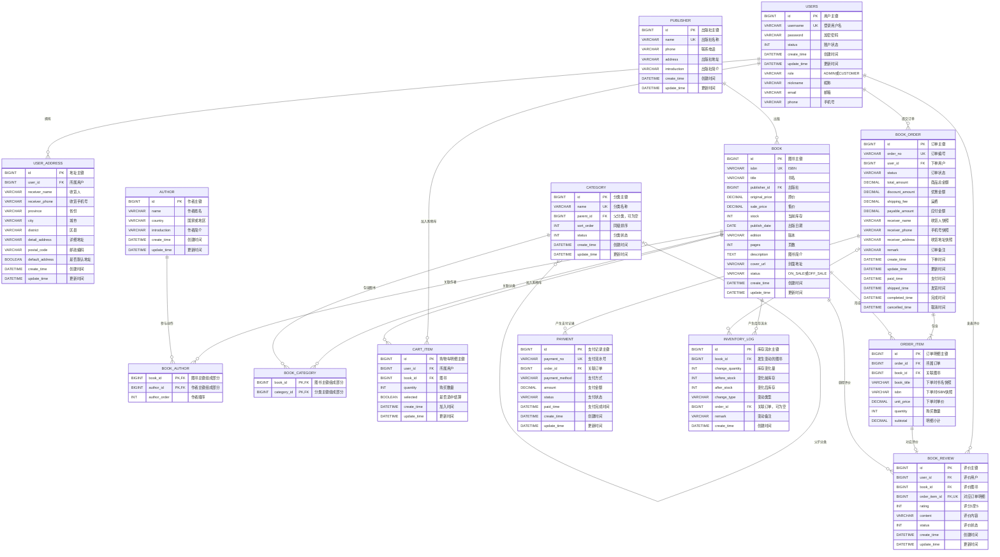

# 网上书店系统 ER 图

本 ER 图根据 `src/main/java/com/example/demo/entity` 中的 JPA 实体类生成。

- `PK`：主键
- `FK`：外键
- `UK`：唯一键
- `BOOK_AUTHOR` 和 `BOOK_CATEGORY` 使用联合主键
- `CART_ITEM` 中 `(user_id, book_id)` 构成联合唯一约束
- `BOOK_REVIEW.order_item_id` 唯一，表示一条订单明细最多评价一次
- 订单地址、书名、ISBN 和成交单价属于历史快照字段

## 核心关系说明

1. 一个用户可以拥有多个收货地址、购物车明细、订单和评价。
2. 一个出版社可以出版多本图书。
3. 图书与作者通过 `BOOK_AUTHOR` 形成多对多关系。
4. 图书与分类通过 `BOOK_CATEGORY` 形成多对多关系。
5. 分类通过 `parent_id` 实现树形自关联。
6. 一个订单包含一条或多条订单明细，也可以产生多次支付记录。
7. 一条订单明细最多对应一条评价。
8. 图书库存的每次变化记录在 `INVENTORY_LOG` 中，库存流水可以关联订单。